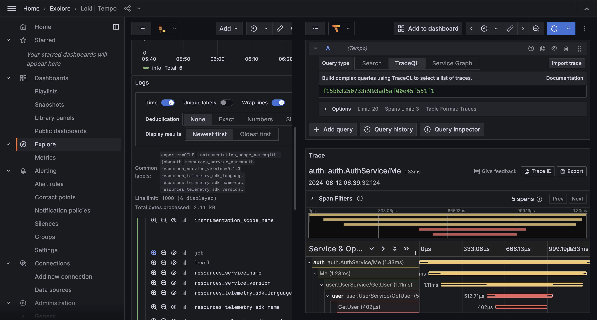

# golang-grafana-otel

A nexample Metric, Traces and Log collection from Microservices with Open Telemetry and Distributed it with (Loki, Tempo and Grafana).

## Todo

- Metric Visualitation
- Log Visualitation