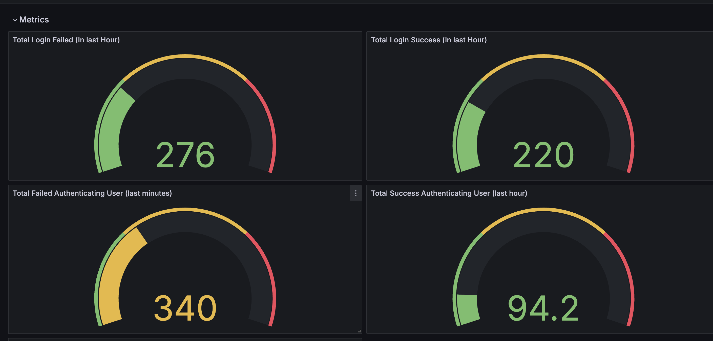
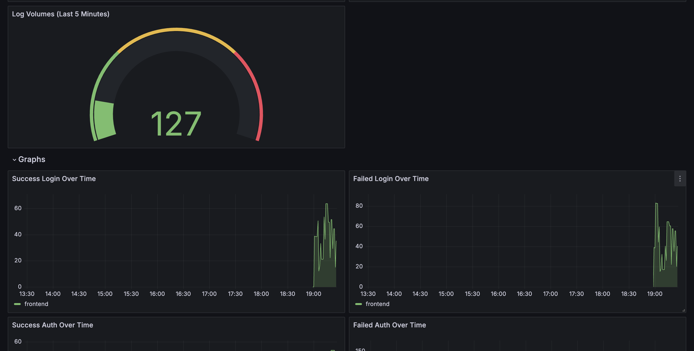
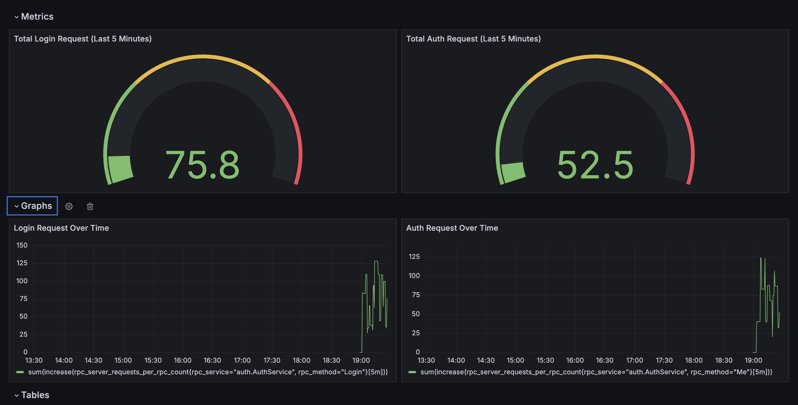
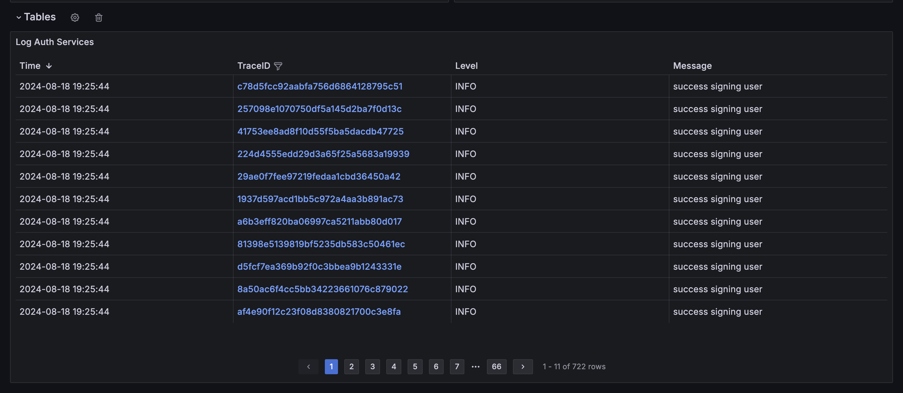
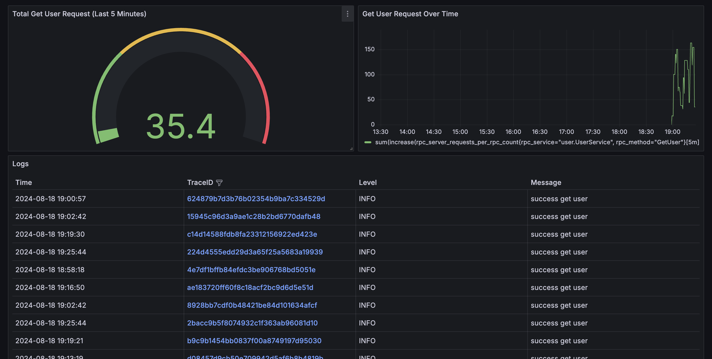

# golang-grafana-otel

An example Metric, Traces and Log collection from Microservices with Open Telemetry and Distributed it with (Loki, Tempo and Grafana).


# Project Structure

```bash
| configs       # is grafana stack configuration
| dashboards    # is grafana provisioning dashboards
| services      # example microservices
    | user      # user service
    | auth      # auth service
    | frontend  # frontend service
```

## Installations

### Cloning repository
```bash
git clone git@github.com:nandanurseptama/golang-grafana-otel.git your-folder-name
```

### Initialization

Create `volumes` folder inside project folder. This folder will be used to mounting `volumes` when use `docker compose`

```bash
cd your-folder-name
```

Then, init sqlite DB for user service
```bash
mkdir -p volumes/services/user
touch volumes/services/user/sqlite.db
```

### Build All Services
I already create `sh script` to build all service image, so you can execute that script.

```bash
sh build_services.sh
```
### Running Containers
When all `services` builded, you can run Grafana stack and `services` with docker compose
```bash
docker compose up -d
```

## Play Around
After containers running, you can access `localhost:3000` inside browser and it will open Grafana

### Frontend Dashboard




### Auth Service Dashboard



### User Service Dashboard
